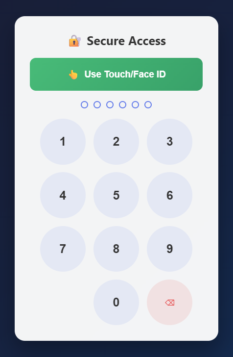
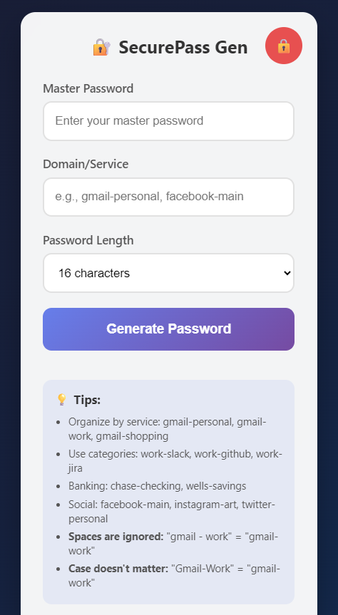
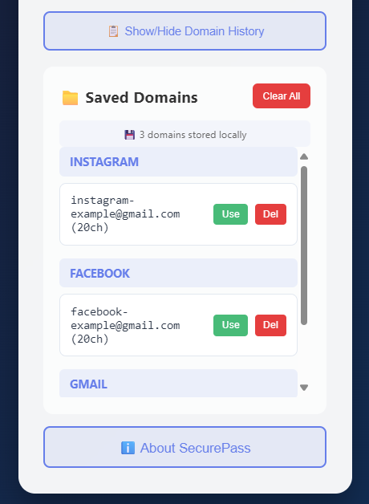
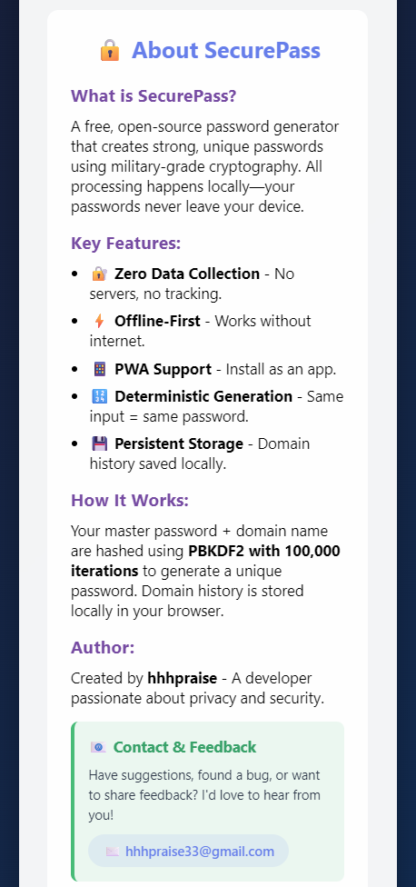

# SecurePass - Password Generator

A secure, client-side password generator that creates strong, unique passwords without ever storing or transmitting your data.

## Features

- 🔒 **Military-grade security** using PBKDF2 with 100,000 iterations
- 📱 **Works offline** - no internet connection required
- 💾 **No data collection** - your passwords stay on your device
- 🛡️ **PIN/biometric protection** to secure your password vault
- 🌐 **Cross-platform** - works on all modern browsers and devices
- 🔄 **Deterministic generation** - same inputs always produce the same password
- 📋 **Domain history** - remembers your frequently used services
- 🏷️ **Smart categorization** - organizes passwords by service/category

## How It Works

SecurePass generates passwords using a cryptographic algorithm that combines:
1. Your master password
2. The domain/service name
3. A cryptographic salt

The same combination will always produce the same password, so you never need to store your passwords. Just remember your master password and the service names you used.

## Usage

1. **Set up your PIN** (first time only)
2. Enter your master password
3. Enter the domain/service name (e.g., "gmail-personal")
4. Select password length (default 16 characters)
5. Click "Generate Password"
6. Copy the generated password to use in your service

### Tips for Organization:
- Use categories: `work-github`, `work-slack`, `work-jira`
- Distinguish accounts: `gmail-personal`, `gmail-work`, `gmail-shopping`
- Banking: `chase-checking`, `wells-savings`
- Social: `facebook-main`, `instagram-art`, `twitter-personal`

## Security Details

- All processing happens in your browser - no data is sent to any server
- Uses Web Crypto API for secure password generation
- PBKDF2 with 100,000 iterations for key derivation
- 256-bit cryptographic operations
- Auto-locks after 5 minutes of inactivity

## Installation

### As a Web App:
1. Visit [https://hhhpraise.github.io/password-generator/](https://hhhpraise.github.io/password-generator/)
2. Add to home screen (mobile) or bookmark (desktop)

### Local Development:
1. Clone this repository
2. Open `index.html` in any modern browser
3. No server required - works completely client-side

## Browser Support

Works on all modern browsers including:
- Chrome
- Firefox
- Safari
- Edge
- Mobile browsers (iOS Safari, Chrome for Android)

## Privacy Policy

This application:
- Does not collect any personal information
- Does not use cookies or tracking
- Stores all data locally in your browser
- Does not transmit any data over the network

Your master password and generated passwords never leave your device.

## License

MIT License - Free for personal and commercial use

## Screenshots

 <!-- Replace with actual screenshots -->

## About the Developer

Created by [hhhpraise](https://github.com/hhhpraise) - A developer passionate about online security and privacy.

---

**Note:** Always remember your master password. Without it, you cannot regenerate your passwords. The developer cannot recover lost passwords as they are never stored or transmitted.